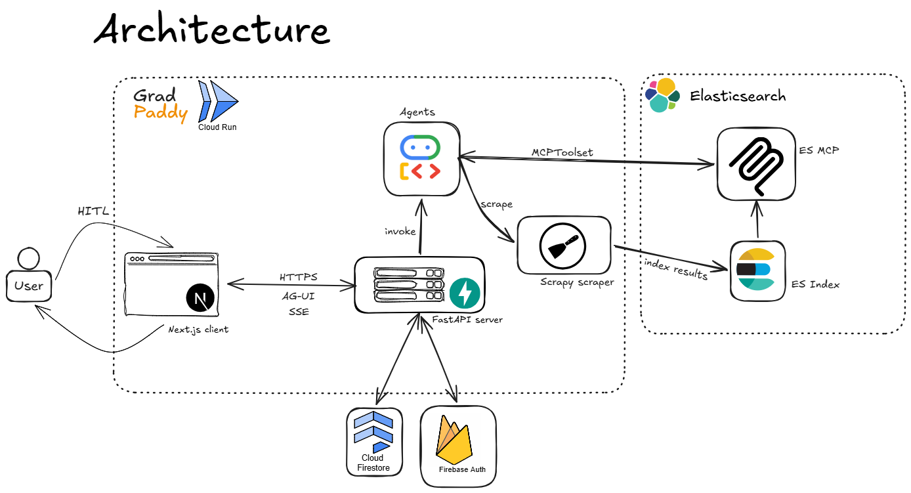
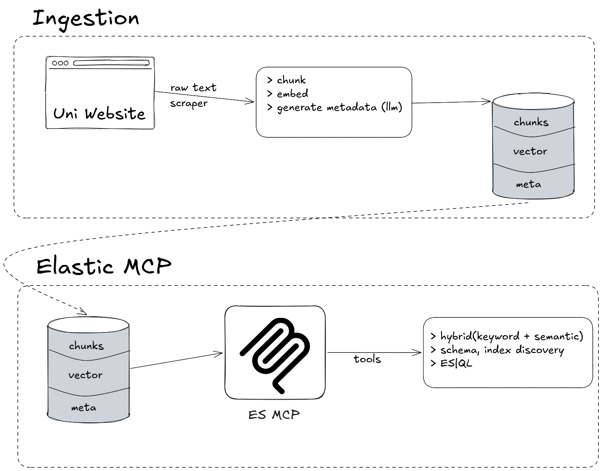

# Grad Paddy

> AI-powered graduate school application co-pilot — built for the [Google Cloud Rapid Agent Hackathon](https://rapid-agent.devpost.com/).

**Live app:** https://grad-paddy-frontend-1001846806436.us-central1.run.app

**Demo video:** <!-- Add YouTube URL here -->

---

## What It Does

Applying to graduate school while working full-time is one of the most cognitively demanding pipelines a young professional faces. Grad Paddy is a multi-agent AI system that takes that entire pipeline — researching programs, finding advisors, writing drafts, emailing professors, tracking deadlines — and runs it alongside you, in one chat interface.

Key capabilities:

- **Program discovery** — searches a curated Elasticsearch index of graduate programs for requirements, deadlines, and tuition by research area, country, or university
- **Faculty matching** — hybrid semantic + BM25 search over scraped faculty profiles enriched with Google Scholar publications; ranks candidates by fit and evidence
- **Document drafting** — generates and iterates on Statements of Purpose, research narratives, and outreach emails tailored to each program and professor
- **Application tracker** — manages a full list of applications, deadlines, and recommenders with status tracking
- **Gmail outreach** — drafts and routes professor/recommender emails through a human-approval gate before sending
- **Google Calendar integration** — surfaces application deadlines and interview slots in the user's calendar
- **Long-term memory** — distils durable facts about the user (research interests, degree goals, work history) into Elasticsearch and proactively injects them into every agent turn
- **Human-in-the-loop (HITL)** — every write action (shortlist, tracker, draft, delete) surfaces an approval card before executing; irreversible actions (deletes, emails) require approval even when auto-approve is on

---

## Architecture



The backend is a multi-agent system built on **Google ADK**. A root `LlmAgent` dispatches to two specialised subtrees:

- **Domain orchestrator** — read-only research branch: faculty discovery, program deep-dive, web search, URL context, and SOP/outreach chain writers
- **Internal app agent** — stateful write branch: owns all CRUD tools, HITL gate, Gmail send, and Calendar management

Agents communicate via ADK's native transfer mechanism. All agent-to-frontend streaming uses the **AG-UI protocol** over Server-Sent Events.

### Elastic Data Flow



1. A **Scrapy + Playwright** spider crawls graduate program pages and faculty profile URLs
2. Faculty profiles are enriched with Google Scholar publication data via the `scholarly` library
3. Cleaned items are indexed into **Elasticsearch** with `semantic_text` fields backed by a **Vertex AI text-embedding** inference endpoint — Elastic handles all embedding on write
4. At query time, agents issue **hybrid search** (semantic + BM25) through native ADK tools and through the **Elastic Agent Builder MCP** server, which gives agents direct access to Kibana-managed search tools without extra code

Long-term user memory is stored in a separate `user-memories` index using the same `semantic_text` + Vertex AI inference pattern. Retrieval uses hybrid search with a recency boost. Memory extraction runs as a background callback after each agent turn — off the model's critical path.

---

## Agent Tree

```
root_agent  (LlmAgent + BuiltInPlanner)
├── domain_orchestrator_agent
│   ├── faculty_discovery_agent         ← Elastic hybrid search + MCP
│   ├── program_deep_dive_agent         ← Elastic hybrid search + MCP
│   ├── researcher_agent                ← Google Search + URL context
│   ├── sop_translation_chain           ← SequentialAgent (research → draft → refine)
│   ├── outreach_prep_chain             ← SequentialAgent (faculty → email draft)
│   └── research_narrative_chain        ← SequentialAgent
└── internal_app_agent
    ├── Account tools    (profile, preferences)
    ├── Application tools (shortlist, tracker, drafts, recommenders)
    ├── Operations tools  (Gmail send, Calendar, CV ingestion)
    └── Governance tools  (HITL gate)
```

---

## Google Cloud Products Used

| Product | Role |
|---|---|
| **Vertex AI** | LLM inference for all Gemini model calls; text-embedding inference endpoint for Elasticsearch `semantic_text` fields |
| **Gemini** (`gemini-3.1-flash-lite`, `gemini-3.1-pro-preview`) | Powers every agent in the tree |
| **Google ADK** (Agent Development Kit) | Agent orchestration, tool routing, session management, HITL, AG-UI streaming |
| **Cloud Firestore** | User profiles, sessions, shortlists, tracker, drafts, HITL state |
| **Firebase Authentication** | Google OAuth login; ID token validation on every API request |
| **Firebase Storage** | CV file uploads |
| **Cloud Run** | Production deployment target for both backend and frontend |
| **Artifact Registry** | Docker image storage for CI/CD |
| **Google OAuth / Gmail API** | Professor and recommender outreach emails sent on behalf of the user |
| **Google Calendar API** | Application deadline and interview event management |

---

## Other Tools & Products Used

| Tool | Role |
|---|---|
| **Elasticsearch** | Graduate program index, faculty profile index, user memory index |
| **Elastic Agent Builder MCP** | MCP server that exposes Kibana-managed Elastic tools directly to ADK agents |
| **FastAPI** | Backend REST + SSE streaming API |
| **Next.js** | Frontend (App Router) |
| **AG-UI Protocol** | Streaming agent event protocol between backend and frontend |
| **Scrapy + Playwright** | Web scraper for graduate program pages and faculty profile URLs |
| **scholarly** | Google Scholar publication retrieval for faculty enrichment |
| **pdfplumber** | PDF parsing for CV uploads |
| **LangChain text-splitters** | Document chunking during CV ingestion |
| **Docker** | Containerisation for both services |
| **GitHub Actions** | CI/CD — builds, pushes to Artifact Registry, deploys to Cloud Run |
| **uv** | Python dependency management |

---

## Docker Setup

Each service has its own Dockerfile. Run them independently or together using the instructions below.

### Backend

```bash
cd backend

# Build
docker build -t grad-paddy-backend .

# Run — mount a service account JSON and pass env vars
docker run -p 8080:8080 \
  -v "$(pwd)/service-account.json:/app/secrets/service-account.json:ro" \
  -e GOOGLE_APPLICATION_CREDENTIALS=/app/secrets/service-account.json \
  -e GOOGLE_CLOUD_PROJECT=your-project-id \
  -e GOOGLE_GENAI_USE_VERTEXAI=true \
  -e FIRESTORE_DATABASE_ID=grad-paddy-db \
  -e STORAGE_BUCKET=your-project.appspot.com \
  -e ELASTIC_API_KEY=your-key \
  -e ELASTIC_MCP_URL=https://your-kibana.elastic.cloud/... \
  -e GOOGLE_OAUTH_CLIENT_ID=your-client-id \
  -e GOOGLE_OAUTH_CLIENT_SECRET=your-client-secret \
  grad-paddy-backend
```

Backend will be available at `http://localhost:8080`.

> The image installs Playwright's Chromium browser during build (`playwright install chromium --with-deps`) so the scraper runs inside the container without any host-side browser setup.

### Frontend

The frontend uses Docker Compose. `NEXT_PUBLIC_*` variables are baked into the client bundle at build time, so they must be present as build args.

```bash
cd frontend
cp .env.local.example .env.local   # fill in values
docker compose up --build
```

Or build manually with explicit args:

```bash
docker build \
  --build-arg NEXT_PUBLIC_FIREBASE_API_KEY=... \
  --build-arg NEXT_PUBLIC_FIREBASE_AUTH_DOMAIN=... \
  --build-arg NEXT_PUBLIC_FIREBASE_PROJECT_ID=... \
  --build-arg NEXT_PUBLIC_FIREBASE_STORAGE_BUCKET=... \
  --build-arg NEXT_PUBLIC_FIREBASE_MESSAGING_SENDER_ID=... \
  --build-arg NEXT_PUBLIC_FIREBASE_APP_ID=... \
  --build-arg NEXT_PUBLIC_API_BASE_URL=http://localhost:8080 \
  -t grad-paddy-frontend .

docker run -p 3000:3000 grad-paddy-frontend
```

Frontend will be available at `http://localhost:3000`.

---

## Local Development

### Prerequisites

- Python 3.12+, [`uv`](https://docs.astral.sh/uv/getting-started/installation/)
- Node.js 20+, npm
- A Google Cloud project with Vertex AI and Firestore enabled
- A Firebase project (Auth + Storage)
- An Elasticsearch cluster with Elastic Agent Builder configured

### Backend

```bash
cd backend
cp .env.example .env        # fill in credentials
uv sync
uv run fastapi dev          # http://localhost:8000
```

Key environment variables (see `.env.example` for the full list):

```env
GOOGLE_CLOUD_PROJECT=your-project-id
GOOGLE_GENAI_USE_VERTEXAI=true
FIRESTORE_DATABASE_ID=grad-paddy-db
STORAGE_BUCKET=your-project.appspot.com
ELASTIC_API_KEY=...
ELASTIC_MCP_URL=https://your-kibana.elastic.cloud/...
GOOGLE_OAUTH_CLIENT_ID=...
GOOGLE_OAUTH_CLIENT_SECRET=...
```

### Frontend

```bash
cd frontend
cp .env.local.example .env.local   # fill in Firebase config
npm install
npm run dev                         # http://localhost:3000
```

### Running the scraper

```bash
cd backend/src/scraper
pip install -r requirements.txt
scrapy crawl grad_program_spider    # indexes programs into Elasticsearch
python faculty_query.py             # indexes faculty profiles
```

---

## API

Authentication: every `/api/*` request requires a Firebase ID token:

```http
Authorization: Bearer <firebase-id-token>
```

### Agent chat — `POST /api/chat`

The main streaming endpoint follows the **AG-UI protocol**. The frontend uses the `@ag-ui/client` `HttpAgent` to connect:

```typescript
new HttpAgent({
  url: `${BASE}/api/chat`,
  headers: { Authorization: `Bearer ${token}` },
  threadId,          // maps to an ADK session
  initialMessages,   // prior message history
  initialState: {},
});
```

The server streams back AG-UI events (`RunStartedEvent`, `TextMessageContentEvent`, `ToolCallStartEvent`, `StepStartedEvent`, etc.) as newline-delimited JSON. The frontend subscribes to these to render the chat and activity panel in real time.

### Stop a running turn — `POST /api/chat/stop`

```http
POST /api/chat/stop
Content-Type: application/json

{ "thread_id": "<session-id>" }
```

Cancels an in-flight agent turn. Returns `{ "cancelled": true }` if a run was found, `{ "cancelled": false }` otherwise.

### Debug endpoint — `POST /api/chat/debug`

A plain JSON endpoint for Swagger/manual testing — sends a prompt and returns the final text response synchronously (no streaming). Not used by the frontend.

### Other routes

| Prefix | Resource |
|---|---|
| `POST /api/users/me` | Create or fetch user profile |
| `/api/sessions` | Chat session CRUD + messages + rename/star/group |
| `/api/hitl` | HITL pending/history + resolve |
| `/api/shortlist` | Faculty shortlist CRUD |
| `/api/tracker` | Application tracker + recommenders + calendar |
| `/api/drafts` | SOP and email draft CRUD |
| `/api/emails` | Email draft CRUD + send via Gmail |
| `/api/cvs` | CV upload, download, and management |
| `/api/integrations/google` | Google OAuth connect/disconnect/status |
| `/api/memory` | Long-term memory save/search/delete |

See `backend/API_DOCUMENTATION.md` for full request/response schemas.

---

## Human-in-the-Loop Design

Every state-changing action surfaces an approval card in the UI before executing. The agent calls `request_hitl` with a structured payload describing the exact change (entity, action, fields), then waits. The frontend renders the card; the user approves, edits, or rejects. Irreversible actions — deletes and outgoing emails — always require approval, even when the user has enabled auto-approve mode.

See `docs/hitl-contract.md` for the full HITL event contract.

---

## Team

Built by [Olamide](https://github.com/olamideba), [Firdous](https://github.com/firdous-ab), [David](https://github.com/gravity8) for the Google Cloud Rapid Agent Hackathon.
